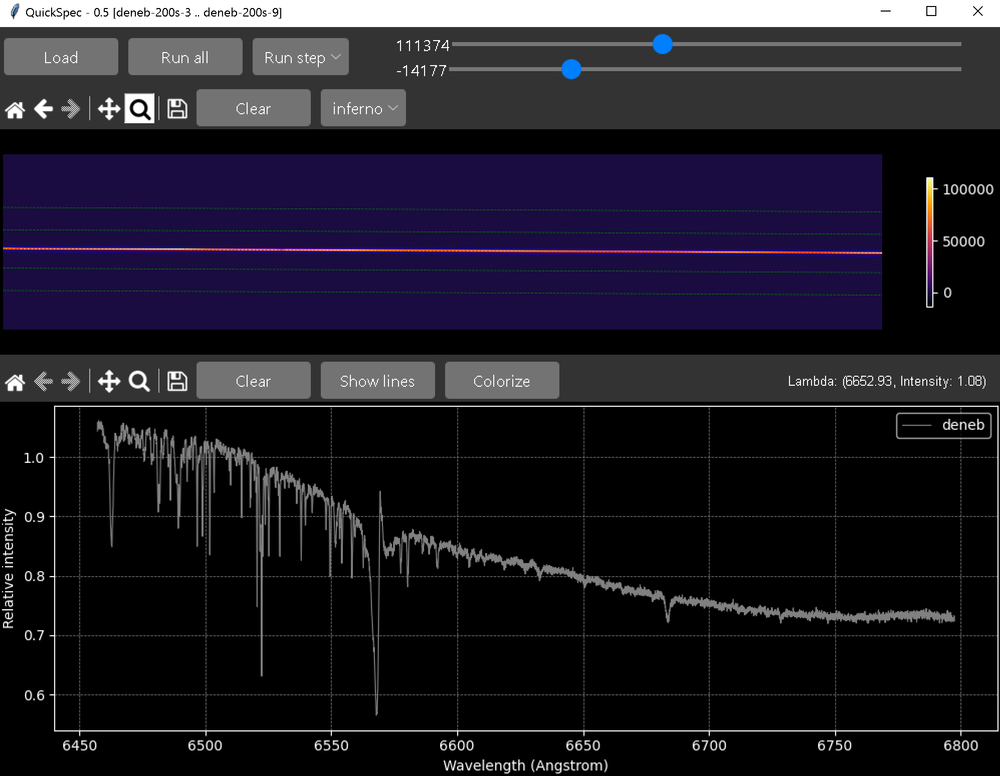

# QuickSpec


Quick-look spectra reduction &amp; calibration tool - aimed at demonstrating spectroscopy science to public or students

:warning: does not produce science-quality spectra - please use instead:

- [specinti](https://solex.astrosurf.com/specinti1_fr.html)
- [demetra](https://www.shelyak.com/logiciel/logiciel-demetra/)
- [spcaudace](http://spcaudace.free.fr)

# Functions
- images viewer with cuts level, zoom, pan, registration and auto sum
- spectra colorized viewer with selected lines display
- one-click images reducer, registration, spectrum extract, calibration, response and normalisation processing
- automatic processing when a new spectra is captured
- single parameter file with changes dynamically applied

# Current limits
- only 2D FITS format images can be read
- only 1D FITS or DAT (2-columns) format spectra can be read
- generated spectra can only be saved as images

# Pre-requisites
- DOF (bias, dark, flat) and response reference files are to be generated by another app

# Installation
from binaries (not ready yet)

from sources:

- download and install a python interpreter: [miniforge](https://github.com/conda-forge/miniforge)
- clone QuickSpec sources: ```$ git clone https://github.com/plouis35/QuickSpec.git``` (or download zip)
- create a new python environment: ```$ conda env create --file environment.yml```
- go to cloned directory: ```$ cd quickspec```
- and run Quickspec : ```$ python quickspec.py```

# Usage
- move the QuickSpec console window so that output logging information is always visible
- press ```load``` button to navigate to and select spectra and/or calibration images; they will automatically be summed
- use a text editor to open and adjust the parameter file created under that images directory (**quickspec.ini**); it is recommended to open the calibration images first in order to define the proper x-pixel / wavelength tuples
- press ```run all``` button to generate the calibrated spectrum
- press ```colorize``` and ```show lines``` to explain spectrum properties
- for demonstration purposes (and debugging), use the ```run step``` buttons
- press ```clear``` or any panel to reset loaded data
