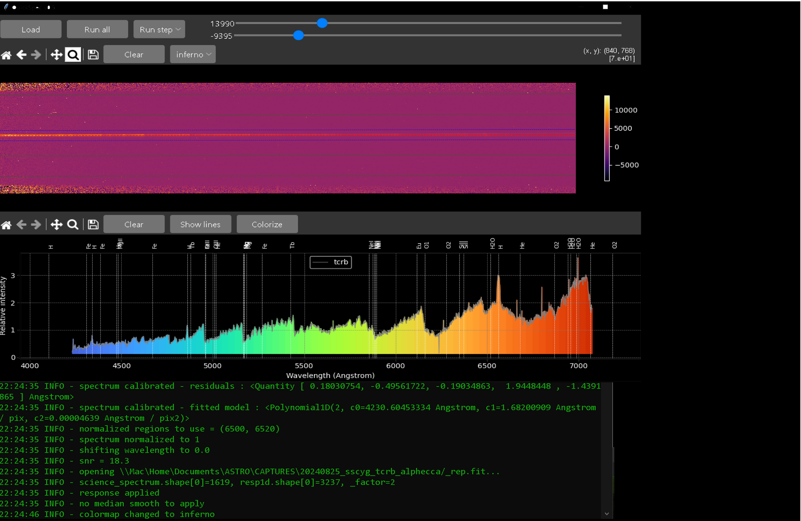

# QuickSpec
Quick-look spectra reduction &amp; calibration tool - aimed at demonstrating spectroscopy to public
> :warning: does not produce science-quality spectra - please use instead:
> - [specinti](https://solex.astrosurf.com/specinti1_fr.html)
> - [demetra](https://www.shelyak.com/logiciel/logiciel-demetra/)
> - [spcaudace](http://spcaudace.free.fr)



# Usage
> [Youtube (French)](https://)

# Installation
from binaries:
> download and extract the following ZIP file:
> - [Windows](https://)
> - [MacOS](https://)
> - [Linux](https://)

> then go to your extracted location and execute:```quickspec[.exe]``` (can take several minutes for the first execution...)

from sources:
> - download and install a python interpreter: [miniforge](https://github.com/conda-forge/miniforge)
> - create a python environment: ```$ conda env create ...```
> - clone QuickSpec sources: ```$ git clone https://github.com/plouis35/QuickSpec.git``` (or download zip)
> - go to cloned directory: ```$ cd quickspec```
> - install requirements: ```$ pip install -r requirements.txt```
> - and run Quickspec : ```$ python quickspec.py```

# Configuration file reference: 
[logger]
level = INFO                                    # DEBUG, INFO, WARNING, ERROR

[display]
theme = dark                                    # dark, light

[pre_processing]
#y_crop = 0.5, 0.3                              # y-relative center, y-relative size arround center
master_offset = _offset.fit                     # masterbias - generated by another app
master_dark = _dark.fit                         # masterdark - generated by another app
master_flat = _flat.fit                         # masterflat - generated by another app
max_memory = 1e9                                # max bytes allocatable during processing
auto_process = Yes                              # detect and process new file under current selected directory

[processing]
trace_method = fit                              # fit (automatic detection), flat (horizontal line)
peak_model = gaussian                           # max, gaussian, centroid
trace_model = models.Polynomial1D(degree=2)     # models.polynomial.Chebyshev1D(), models.polynomial.Legendre1D(), models.Spline1D()
#trace_y_guess = 1695                           # fixed y
trace_y_size = 15                               # spectrum bin size
trace_y_window = 50                             # fit mode window size to search 
trace_x_bins = 12                               # nb of split sections to fit trace
sky_substract = Yes                             # remove sky background ?
sky_y_size = 60                                 # y-size of sky bands
sky_y_offset = 60                               # offset to spectrum trace

calib_x_pixel = 770, 1190, 2240, 3520, 4160                             # pixels x-position of calibration lines
calib_x_wavelength = 6506.53, 6532.88, 6598.95, 6678.28, 6717.04        # corresponding wavelength in Angstrom
input_model = models.Polynomial1D(degree=2)                             # degree changes allowed only

normalized_region = 6500, 6520                  # region to use for normalization
response_file = _rep.fits                       # response spectrum - generated by another app

[post_processing]
#shift_wavelength = 5.5                         # wavelength shift in Angstrom
#median_smooth = 7                              # size of median kernel to apply 

[lines]                                         # ATTENTION: special character not allowed (such as greek chars...)
0.00 = Zero
656.28 = H
486.13 = H
434.04 = H
410.17 = H
397.00 = H 
388.90 = H 
383.53 = H
379.75 = H
527.04 = Fe 
516.89 = Fe 
495.76 = Fe 
466.81 = Fe 
438.36 = Fe 
430.79 = Fe 
448.11 = MgII
518.36 = Mg 
517.27 = Mg 
516.73 = Mg 
585.24 = NeI
588.18 = NeI
589.00 = NaI
589.59 = NaI
615.82 = O1 
627.77 = O2 
686.90 = O2 
718.60 = O2 
760.50 = O2 
898.77 = O2 
495.90 = OIII
500.69 = OIII
651.65 = H2O
694.07 = H2O
695.64 = H2O
698.90 = H2O
396.85 = CaII
393.37 = CaII
706.52 = He
667.82 = He
587.56 = He
501.57 = He
447.14 = He
634.71 = SiII
637.14 = SiII
487.70 = Tb 
542.40 = Tb 
611.60 = Eu 
336.11 = TiII
```

# Some spectrograph calibration configurations: 

```
# HR (starex2400)
calib_x_pixel = 770, 1190, 2240, 3520, 4160
calib_x_wavelength = 6506.53, 6532.88, 6598.95, 6678.28, 6717.04
Ò
# LR (dados200)
calib_x_pixel: 61, 683, 940, 1400, 1540
calib_x_wavelength: 4333.56, 5400.56, 5852.49, 6678.28, 6929.47

# MR (dados900)
calib_x_pixel = 349.965, 376.590, 441.225, 487.131, 539.054, 608.398,  728.015
calib_x_wavelength = 4500.9, 4524.7, 4582.7, 4624.3, 4671.2, 4734.1, 4843.3

```